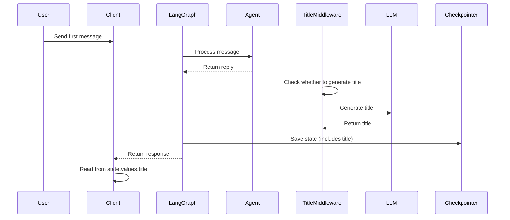

# Auto Thread Title Generation

## Feature Description

Automatically generates a thread title after the user asks their first question and receives a reply.

## Implementation

`TitleMiddleware` runs in the `after_agent` hook:
1. Check if this is the first exchange (1 user message + 1 assistant reply)
2. Check if the state already has a title
3. Call the LLM to generate a concise title (default: up to 6 words)
4. Store the title in `ThreadState` (persisted by the checkpointer)

## Storage Mechanism

### Title storage location

The title is stored in **`ThreadState.title`**, not in thread metadata:

### Persistence

| Deployment | Persistent | Notes |
|------------|------------|-------|
| **LangGraph Studio (local)** | No | In-memory only, lost on restart |
| **LangGraph Platform** | Yes | Automatically persisted to database |
| **Custom + Checkpointer** | Yes | Requires PostgreSQL/SQLite checkpointer |

### How to enable persistence

If you need persistence in local development, configure a checkpointer:

```python
# checkpointer.py
from langgraph.checkpoint.sqlite import SqliteSaver

checkpointer = SqliteSaver.from_conn_string("checkpoints.db")
```

Then reference it in `langgraph.json`:

```json
{
  "graphs": {
    "lead_agent": "src.agents:lead_agent"
  },
  "checkpointer": "checkpointer:checkpointer"
}
```

## Configuration

In `config.yaml` (optional):

```yaml
title:
  enabled: true
  max_words: 6
  max_chars: 60
  model_name: null  # use default model
```

Or configure in code as needed.

## Client Usage

### Get Thread Title

```typescript
// Method 1: fetch thread state
const state = await client.threads.getState(threadId);
const title = state.values.title ?? "New Conversation";

// Method 2: listen to stream events (if your client supports it)
```

### Render Title

```typescript
// Show in conversation list
<li>{title}</li>
```

**Note**: The title is stored at `state.values.title`, not `thread.metadata.title`.

## Workflow



## Benefits

- Reliable persistence via LangGraph state
- Fully backend-driven
- Automatic trigger after first exchange
- Configurable length and model
- Strong fallback behavior (uses first few words if LLM fails)
- Consistent with existing middleware architecture

## Notes

1. **Read location**: Title is in `state.values.title`, not `thread.metadata.title`
2. **Performance**: Adds ~0.5-1s latency per thread (LLM call)
3. **Concurrency**: Runs after agent execution; does not block the main flow
4. **Fallback**: If LLM fails, uses the first few words of the user message

## Tests

```bash
# TODO: add unit tests
```

## Troubleshooting

### Title not generated

1. Check config: `title.enabled = true`
2. Search logs for "Generated thread title"
3. Confirm it is the first exchange (1 user message + 1 assistant reply)
